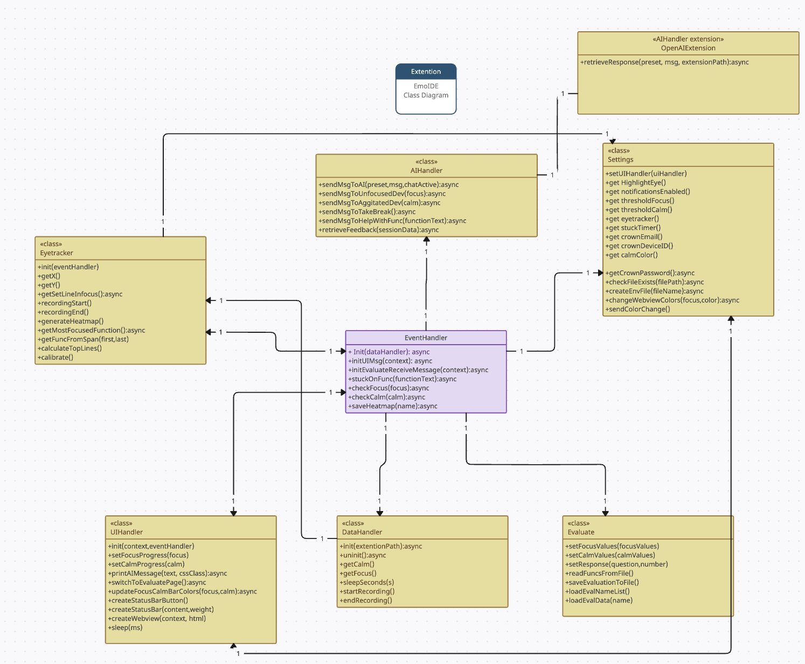

# Developer manual for Emotionally Aware IDE

**Revisited:** 27-05-2024

## Abstract

This manual is for a developer who wishes to make changes in the code. In this document you will find:

- Where to find every functions
- How the components interact with each other
- Explain the most important functionality

## Table of Contents

- [Introduction](#introduction)
- [Current restraints/requirements of environment](#current-restraintsrequirements-of-environment)
- [Most important functionalities](#most-important-functionalities)
  - [Neurosity crown](#neurosity-crown)
  - [Gazepoint GP3 (Eye-tracker)](#gazepoint-gp3-eye-tracker)
- [Coding conventions](#coding-conventions)
  - [Javascript](#javascript)
  - [Python](#python)
- [Class diagram](#class-diagram)
- [Navigating the files](#navigating-the-files)
- [Known bugs](#known-bugs)

---

## Introduction

### Authors and developers

The plugin was developed as a project course at BTH (Blekinge Tekniska Högskola) by second year students of the software development master program.

## Current restraints/requirements of environment
### Screen Size and Screen Restraints
Screen sizes are limited to 1920x1080 monitors. Otherwise the eye-tracker will not work optimally with our extension. Curved monitors are not recomended as testing has not been done with it.

### Imports/installs
You need to install:
* dotenv (`npm install dotenv`)
* OpenAI (`npm install openai`)
* Neurosity SDK (`npm install @neurosity/sdk`)
* vscode (`npm install vscode`)
* net (`npm install net`)
* xmldom (`npm install xmldom`)
* matplotlib (`pip install matplotlib`)

A .env file with the API key and organization must be created with values for OPENAI_API_KEY and OPENAI_ORGANIZATION (see `OpenAIExtension.js`).

After this you should be able to use our extension.

### Programming languages supported
As of now the only supported language for programming in our extesion is Python. This is because the ast tree is only supported for python code. This leads to the functions not being read properly by `find_definition` in `findFuncFromLines.py`.

### System requirements
macOS with M-series chip are not recomended for this extension. Attempts with M1 chip and macOS Sonoma 14.4.1 has been made, but were unsuccessful. Therefore windows OS is recommended.

## Most important functionalities

### Neurosity crown
One of the most important functionality is the Neurosity Crown. This is handled inside the `DataHandler.js` file.

#### Focus
The focus is a value calculated from the Neurosity Crowns API.

#### Calm
The calm is a value calculated from the Neurosity Crowns API.

#### If crown is not connected
If the crown is not connected, or a false log in has been entered, the data for focus and calm are generated.

### Gazepoint GP3 (Eye-tracker)
The eyetracker allows for the user to see where on the screen and what functions they are looking at.

## Coding conventions

### JavaScript
In JavaScript we adhere to the camelCase convention for naming variables, this is the standard for js. We also tried to have the variable names as explanatory as possible so that we did not need much comments in the code. Docstrings are available for some of the functions.

### Python
In Python we adhere to the snake_case convention for naming variables, this is the standard for py. We also tried to have the variable names as explanatory as possible so that we did not need much comments in the code. Docstrings are available for some of the functions.

## Class diagram

## Navigating the files

### AIhandler.js
The AIHandler class is the controller for our AI usage. It has the ability to send messages via `sendMsgToAI()` where it also retrieves the message. This also has the functions that sends the messages when a developer either has low focus or low calm. It also sends the message to explain a function ia `sendMsgHelpWithFunc()`. All of these sendMsgXXX functions call on the main send function called `sendMsgToAI()`, but it uses a diffrent prompt for it.

#### Prompts
We decided to have a few standard prompts in the

### DataHandler.js
The DataHandler is for logging into and handling data from Neurosity. If login fails, it will generate simulated (fake) data and return that instead. Creation of simulated data can be affected with the boolean createFakeDataIfNotLoggedIn. The function init(extensionPath) takes the directory of the extension as a parameter, and tries to log in with the envNeurosity.env file found in that folder, or if that fails it sets up the creation of simulated data. The uninit() function resets the DataHandler instance. The getCalm and getFocus functions get the average calm and focus values respectively from the Neurosity device over the last 20 seconds (as defined in milliseconds by recentCalmDuration and recentFocusDuration). There is a helper function sleepSeconds, which is awaitable. The startRecording and endRecording functions are used to store the calm and focus values in the calmValuesSession and focusValuesSession variables. This class also holds the loop which created the nodes for the evaluation graph.

### Evaluate.js
The Evaluate class is used for saving data from a session and evaluation to a json file called `evaluations.json`. The first functions are setFocusValues and setCalmValues which are called in eventhandler to prepare values gathered during a session to be saved. We also have readFuncsFromFile which reads in the functions you looked at during the session. After this comes saveEvaluation to file which does the actual saving. It gathers the focusvalues, calmvalues, functions, top functions, heatmap, and answers to question, formats these in a object which is then saved to `evaluations.json`. Additionally, this class has two functions to load data from the json file. The first one is loadEvalNameList which simply loads in all the names of the saved session so that these can be shown in the drop down menu in the evaluation page. We also have loadEvalData which loads in the data from a specific session which is also used in the evaluation page when the user want to view an old session.

### evaluateWebView.js`
`evaluateWebView.js` builds around the evaluate html document it handles events and manages relevant information it cooparetes with `EventHandler.js` and `Evaluate.js`
it utilizes canvas.js for graph functionallity.
For further graph documentation visit: (https://canvasjs.com/).

`EvaluateWebView.js` is the script file for `evaluate.html`. It contains functions:

`focusSlider.oninput`: Updates the focus slider values on input

`calmSlider.oninput`: Updates the calm slider values on input

`createChart()`: Renders and sets up the chart from canvasjs

`addSymbols(e)`: Sets up suffixes for the chart

`gatherResponses()`: Collects all values of a session

`saveEvaluateResponses()`: Prepares all values and sends them to evaluate

`setTopfunction(funcname)`: Creates a list in the html with the top functions

`scrollToFunctionCanvas(e)`: Sends a message to trigger a scroll function

`clickedFunctionCanvas(e)`: Handles click events on the chart nodes

`setFunctionContentArea(visible, text)`: Manages the visibility and content area for the functions

`setAiResponse(aioutput)`: Sets the ai response in the html document.

`populatedropdown()`: Fills the dropdown with the names from evaluations.json

`toggleRatingInput()`: Handles the accessibility to rating

`changeHeatmapImageSrc(newSrc)`: Setups for correct heatmap display

`loadSession(extensionPath)`: Loads in all the data from a session and displays it

`selectElement.addEventListener("change", function(event))`: Sends name to Evaluation.js to retrieve data for that name

`selectElement.addEventListener("focus", function(event))`: Saves the newest session when dropdown is in focus

`window.addEventListener("message", e -> {})` : Is a mailbox for the script file

### EventHandler.js
EventHander is can be seen as the controller of all other classes. Almost all events and information pass through and is handled by this class. Firsly, it has a function called `initUIMessage` which handles events caused by UI interaction in the main extension page (the one with the AI chat in the middle). The first case, 'user', is the event when the user types a message to the AI assistent in the chat. The message is sent to AI handler and we get a response which is then sent back to the UI. After this we have the case 'gotoEval', which is used for switching to the evaluation page after a session or when the 'evaluate page' button is pressed. We finally have the case 'recording' which inits a recording when record button is pressed and stores all relevant data when recording is done.

The second function is `initEvaluateRecieveMessage` which is similar to the first one as it also handles UI messages. However, in this case we recieve messages form the evaluation page. The first message, 'evaluateResponses', handles saving a session. It recieves data from different modules and calls function from `Evaluate` class to save these. 'nameRequest' is used to get the data from a selected function so that this can be shown to the user. 'scrollFunctions' is used when a user press a function in the evaluation page so that the editor automatically scrolls to that function in the code. 'relevantDataForAi' sends data from a session to the `AiHandler` to get feedback for the session based on the data.

We have a couple of additional functions. The first one being `stuckOnFunction` which is used for sending an AI-generated explanation when a user has looked at the same function for a longer period of time. `checkFocus` and `checkCalm` checks if focus/calm has dropped below threshold and if so, send advice in chat on how to regain focus/calm.

### extension.js
The `extension.js` file is what handles the main program of the extenion, the `activate()` function is what runs when the extension activates (which we have set to be on startup in package.json). The `activate()` functions begins by initializing all instances of all classes, the order is very important and should not be changed. It then starts the main program loop which gets calm/focus values and sends them to the UIHandler to display, it updates the focus/calm bar and calls the EventHandler function that checks if the values are under the threshold, finally it runs eyetracker check which records which line is in focus.

### Eyetracker.js
This file requires `net` and `xmldom` to be installed via `npm install net, xmldom`. It handles the client-server for the eye-tracker. From the eye-tracker we get x,y-values which are then converted to a line. This is done in the `getSetLineInFocus()` method which is called from extension.js. Here we also handle the calculations for top lines, calibration and call on generate heatmap.

### heatmapGenerator.py
This file generates the heatmap from the eye-tracking data. We use matplotlib as a library to make the heatmap. The data from the eye-tracker is read from two txt documents, `xValues.txt` and `yValues.txt`. We calculate an intesity for the heatmap, i.e how much we looked at a specific coordinate relative to the others. Then we generate the heatmap in `generate_heatmap()`. This is saved as a png file called `heatmap.png` in the heatmaps folder. Path is `heatmaps/heatmap.png`.

### OpenAIExtension.js
This file handles the API from OpenAI.

- Here you can choose which model to use on line 28: model: `gpt-3.5-turbo` is current. You can change this to `GPT-4o` or `gpt-4-turbo`. The documentation for this is avilable on: https://platform.openai.com/docs/models.

- This file contains the `retrieveResponse(p,m,e)` function. It takes in a preset, which is some standard text that goes before the message. It also takes the message and and extension path.

- You can also set the max lenght of a message that can be sent. Standard in our extension is 2500.

- There is a safetey mechanism that is commented out, which can be used when testing out new functionalities that risk spamming the AI so as to not run out of funds.

### UIhandler.js
The UIHandler class has the following functions:

- `setFocusProgress(f)` and `setCalmProgress(c)`; These functions send the focus and calm values gathered from the crown to the webview.

- `printAIMessage(t,c)`; This function waits for the webview to be visible, then sends text with a specific cssClass to the webview for displaying a chat message from the AI.

- `switchToEvaluationPage()`; Creates a new webview for the evaluation window.

The functions outside the class are:

- `createStatusBarButton()`; Creates the 'Open UI' button that pops up when the UI window is closed, it calls the start.ui command which is created in the `init` function, this command itself calls the `createWebView` command to open the UI window.

- `createStatusBar(c,w)`; Creates a status bar item that looks like a block, it is transparent by default and the name and position is sent through the parameters.

- `createWebView(c,h)`; This function creates a webview with a desired html document as the source code.

### webview.js
This file is the script for the 'webview.html' file.

- `setFocusValue(value)` and `setCalmValue(value)`; Chenges the values displayed in the progress and calm bars, as well as the percentage as text.
- `addUserMessage()`; Tries to add the users input text as a message to the chat, as well as sending the message value back to the extension. Also creates the loading symbol in place of the AI response.
- `setAIResponse(text)`; Replaces the AI loading symbol with the response retrieved.
- `addAIMessage(text, type)`; Adds an AI message to the chat with a desired class.
- `textareaChanged(element)`; Called when the text area changes, updates the size counter and restricts user from exceeding size limit.
- `setRecordingButton(recording)`; Used to set record button as recording when UI window is restarted.
- `record(button)`; Toggles the recording state of the record button and sends the new recording state to the extension.
- `setRecordTimeout()`; Used as a mutex to make sure record button can't be spammed.
- `gotoEvaluate()`; Sends message to start evaluation window to the extension.

The file also creates listeners for all messages sent to the webview as well as pressing enter within the text box.

### findFuncsFromLines.py
This file handles finding the function from it's line number. This is used with the eye-tracker. So that if we are looking at line 36, we can know that line 36 is in the function xxx. This is done by generating an AST (abstract syntax tree) then parsing through the nodes until we find the correct function. Each function has a size and start value so we know which lines are in which functions. This data is written to `fullDictionaryFile.txt` file in order to access it later from JavaScript when generating the evaluation screen.

## Known bugs
- B.1 When having a long session (over ~3 hours) the max tokens by GPT is reached. I.e we send to much input to the AI.

- B.2 Loading evaluation page in UI not always working. Sometimes only opens empty tab (very rare).

- B.3 If you open a new "page/window", like settings, while in a session, the session ends as the webview resets and you cause the program to work in an unintended way.

- B.4 If the python code you are writing is not compilable at the time when the AST is generated, the read function program crashes and will not be able to read what function you are looking at, at that time. As soon as it is compilable it will resume working.

- B.5 We have not successfully run our extension on a device with macOS and M-series chip. Only limited attempts have been done with a M1 mac which were not successful.

- B.6 The eyetracker line interpretation only works for some specific resolutions and sizes of screens (1980x1080 17.3" with 30 lines visible is optimal), not exactly a bug but something that should be changed.
