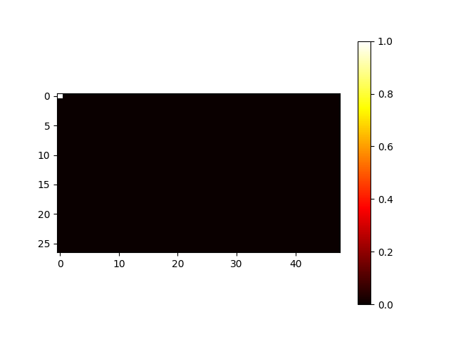

# User Manual for Emotionally Aware IDE

**Revisited**: \today

## Abstract

This user manual guides you through installing and using the Emotionally Aware IDE plugin for VSCode. Designed to enhance programmer productivity, the plugin leverages biosensing technology to monitor your focus and emotional state.

Learn how to:
- Set up the plugin with compatible EEG and eye-tracking devices.
- Utilize real-time focus and calmness levels displayed within VSCode.
- Interact with the AI chat assistant powered by OpenAI's GPT-4 for personalized guidance.
- Start, manage, and evaluate coding sessions with detailed focus and eye-tracking data visualization.

The manual also addresses troubleshooting common issues, data privacy, and explores advanced features for those seeking further customization.

---

## Table of Contents

---

## Introduction

### Authors and Developers

The plugin was developed as a project course at BTH (Blekinge Tekniska Högskola) by second-year students of the software development master program.

## Requirements to Use the Plugin

In order to use the plugin, you will need:
1. VSCode
2. The Crown by Neurosity
3. GP3 Eye-tracker by Gazepoint
4. A wallet from OpenAI with balance along with a key

## How to Install the Plugin

To install the plugin, ensure all requirements in Section 2 are met, then open VSCode.

### In VSCode

1. When you have opened VSCode, click on *Extensions* in the left bar.
   
2. Search for "Emotionally Aware IDE" by Emosoft.
3. Click on it and press *Install*.
4. VSCode should now install the extension. The system might need to restart for changes to take effect.

### Set up Neurosity Crown

To use a Neurosity device, create a file in the main folder (located next to this file) called "envNeurosity.env". This file should contain the following three lines. Keep the quotation marks, and put your Neurosity account & device details inside:

DEVICE_ID="neurosity_device_id_hexadecimal"
EMAIL="neurosity_account@email.com"
PASSWORD="neurosity_password"

### Set up Eye-Tracker

## Features of the Plugin

### Focus

From the crown, a focus level can be measured (in percentage). The focus level is calculated from 8 EEG sensors on the crown. In order to get a smoother change in value, the system takes an average of the last 20 seconds of the focus value. The value is displayed in the UI/chat window at the bottom in a green color. The 20-second average percentage is written above.

If the crown is removed from the head, the values will corrupt. To fix this, you will have to wait for 20 seconds after putting the helmet on again to get accurate values. This also applies when starting the extension.

### Calm

From the crown, the calm level can also be measured (in percentage). The calm level is calculated from 8 EEG sensors on the crown. In order to get a smoother change in value, the system takes an average of the last 20 seconds of the focus value. The value is displayed in the UI/chat window at the bottom in a blue color. The 20-second average percentage is written above.

If the crown is removed from the head, the values will corrupt. To fix this, you will have to wait for 20 seconds after putting the helmet on again to get accurate values. This also applies when starting the extension.

### AI Chat Assistant

The AI chat assistant is displayed in the UI/chat window. To chat with the AI, write a message in the message box and click send or press enter to send. The system will respond in the chat. The AI chat assistant is powered by GPT-4 by OpenAI, therefore you will need to set up an account and load it with a balance to use this plugin.

#### AI Reaction to Calm/Focus Dropping Below Threshold

The user can set a threshold value for both calm and focus. When the focus/calm parameters drop below the threshold, the AI responds to a series of standard prompts.

If the user drops below the focus threshold, GPT-4 generates a message telling the user that they are unfocused and gives some generic advice on how to regain focus. The message pops up in the UI/chat window. In order not to disturb the user, a bar at the bottom of the VSCode screen tells the user what emotional state they are currently in by displaying a color related to this emotion. The colors are:
- Blue - The blue color relates to the user's current focus level. The more focused, the more blue.
- Red - The red color relates to the user's calm level. The more red, the less calm the user is.

### Sessions

A session is a period of time where the system is recording your data. The data being recorded includes:
- Focus level
- Calm level
- Eye-tracker data i.e., where your eyes are looking

All this data is saved temporarily with a timestamp to allow for evaluation after the session is completed. If the plugin is shut down during a session, all data from the session will be lost. You can use the plugin without starting a session, however, you will not be able to extract the data or evaluate your session afterward.

#### Start/End Session

A session can be started by pressing the *Start session* button in the UI/chat window. This will start recording a session. When the session is complete, press *End session* in the UI/chat window. This will allow you to both evaluate the data in VSCode and extract the data from VSCode.

#### Evaluate Session

After a session is complete, meaning that a session has been started and ended, you are presented with an alternative to evaluate the session. If you choose to evaluate the session, you will be able to see a graph of your focus and calm levels on the y-axis and time on the x-axis. You will also see a heatmap of where your eyes were looking and for how much of the time you were looking away from the screen.

## Troubleshooting

## Advanced Features

### Eye-Tracking Features for Detecting Focus on Specific Areas of the Code

#### Calibration of Eye-Tracker

The calibration of the eye-tracker is done in Gazepoint control, a program made by Gazepoint. Open the program and click *Calibrate*. After the calibration is done, the program can be used with the eye-tracker. Note that the eye-tracker has an accuracy of 1-2 degrees when correctly calibrated.

#### Use of Eye-Tracker

When using the eye-tracker, the extension is able to detect which line the user is looking at by highlighting the line above, under, and the line the user is currently looking at. If the user is stuck on a line or a specific function, GPT-4 will generate an explanation or, if available, a manual page. In order for this function to work, the user has to:
- Have font size 14 (default for VSCode)
- Make sure the terminal is in a position so that the user can see exactly 30 lines of code in the coding window.

This function can be disabled in settings.

#### Generating a Heatmap

A heatmap can be generated when using the eye-tracker. The heatmap is divided into blocks 27x48. After a session is completed, a heatmap is generated.

White color indicates that this is a hotspot, meaning you have looked for a long period of time at this grid. Black indicates that you have not looked very much at this block.

### Customization Options for UI

Not implemented yet...

### Encryption

Our code uses a process called encryption to protect sensitive data like login credentials. It does this through AES (Advanced Encryption Standard), a secure method for converting information into a form that can't be easily understood by unauthorized people.

A special password and random numbers called a salt are used to create a unique key for locking and unlocking information (write key). This key is saved in a file for later use. When we want to protect information (encrypt message), we scramble it using this key. Later, we can use the key again to unscramble the information (decrypt message), turning it back into its original form.

This process ensures that even if someone gets hold of the protected information, they won't be able to understand it without the key. It's important to keep the key and the process of making it safe to ensure the security of the encrypted information.

## Security and Privacy

### Data

No data regarding your emotional state is stored by or sent to the creators. All saves are local to your machine. Note that this data is not encrypted by the plugin. This is up to the user/researcher who extracts/stores the data to do.

### Use of AI

Your focus and calm levels are sent to GPT4 to give context. However, no personal information is sent along with this data making it anonymous. On how OpenAI uses this data, we refer to OpenAI.

### Best Practices for Extracted Session Data

If you plan to store or share the extracted session data containing focus levels, calm levels, and eye-tracking information, here are some best practices to consider:

- **Encryption**: Strongly consider encrypting the extracted data files before storing or sharing them. This adds an extra layer of security to protect sensitive information. Encryption tools are readily available for most operating systems.
- **Access Control**: Limit access to the extracted data only to authorized personnel.
- **Anonymization**: If you plan to share the data for research purposes, consider anonymizing it to remove any personally identifiable information.

By following these practices, you can help ensure the confidentiality and security of your extracted session data.

**Additional Note**:

For detailed information on data security practices, consult with a security professional or refer to relevant data privacy regulations depending on your location and intended use of the data. This is not a guide on how to store data and the author takes no responsibility for how data is used or handled.
